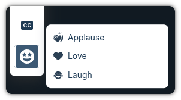
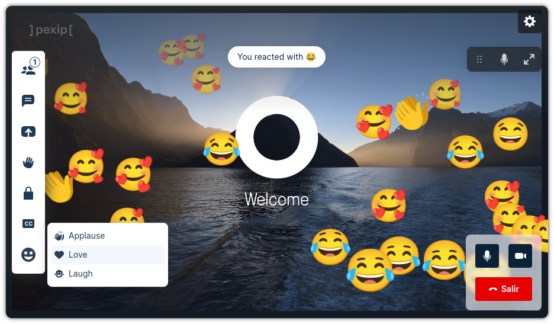

# Web App 3 Plugin: Reactions

This plugin gives the user possibility to share reactions with the rest of
participants in a conference. We have three different reactions: applause, love
and laugh.

For using this plugin you will need **Pexip Infinity v35** or later.

## How to use

The plugin will create a new button on the toolbar that any user can use during
a conference to share reactions with the rest of the participants:

<div align='center'>



</div>

- Once the user click on the button, they will see a toast message on top:

<div align='center'>


</div>

- The rest of the participants will see a similar message:

<div align='center'>


</div>

- An animation will be displayed for all the participants on top of the video:

<div align='center'>



</div>

## Run for development

- To be able to build the plugin, you need to comply with the following versions
  or higher:

  | NodeJS   | NPM     |
  | -------- | ------- |
  | v20.12.2 | v10.5.0 |

- Install all the dependencies:

  ```bash
  $ npm i
  ```

- Before starting the dev server, you need to modify the configuration
  `vite.json`:

  You can modify the following parameters:

  - `infinityUrl`: URL for the Pexip Infinity Conferencing Node.
  - `port`: Port to use for the developer server.
  - `brandingPath`: Path for the branding configured in Infinity.

  Example:

  ```json
  {
    "infinityUrl": "https://pexipdemo.com",
    "port": 5173,
    "brandingPath": "/local-plugin"
  }
  ```

- Run the dev environment:

  ```bash
  $ npm start
  ```

The plugin will be served from https://localhost:5173 (visit that page and
accept the self-signed certificates), but you should access it thought the Web
App 3 URL. You have more information about how to configure your environment in
the
[Developer Portal: Setup guide for plugin developers](https://developer.pexip.com/docs/plugins/webapp-3/setup-guide-for-plugin-developers).

## Build for production

To create a package, you will need to first install all the dependencies:

```bash
$ npm i
```

And now to create the package itself:

```bash
$ npm run build
```

Congrats! Your package is ready and it will be available in the `dist` folder.
The next step is to create a Web App3 branding and copy `dist` into that
branding.

If you want to know more about how to deploy your plugin in Pexip Infinity,
check our [Developer Portal](https://developer.pexip.com).
